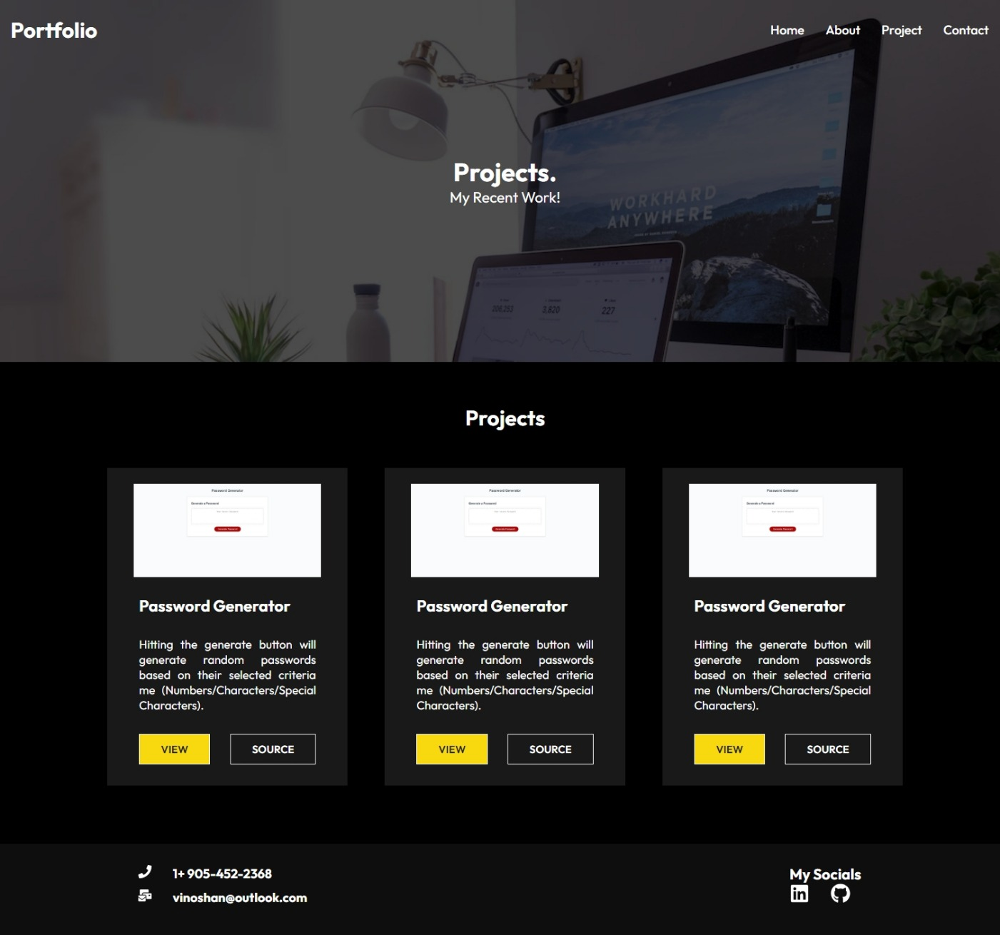

# React Portfolio

## Table of Contents
- [React Portfolio](#react-portfolio)
  - [Table of Contents](#table-of-contents)
  - [Description](#description)
  - [Technologies Used](#technologies-used)
  - [Screenshots](#screenshots)
  - [Installation](#installation)
  - [Usage](#usage)
  - [Deployment](#deployment)
  - [License](#license)
  - [Contact](#contact)

## Description
This is a React-based portfolio application that allows web developers to showcase their work samples and provide information about themselves. It includes a header with navigation links to different sections, including About Me, Portfolio, Contact, and Resume. The application is designed to be user-friendly and visually appealing, with a clean and polished user interface.


## Technologies Used
- React
- React Router DOM
- HTML/CSS
- JavaScript

## Screenshots





## Installation
To run this project locally, follow these steps:

1. Clone the GitHub repository to your local machine.
   ```
   git clone https://github.com/vinoshan/react-portfolio.git
   ```

2. Navigate to the project directory.
   ```
   cd react-portfolio
   ```

3. Install the required dependencies.
   ```
   npm install
   ```

## Usage
After completing the installation steps, you can start the development server by running the following command:
```
npm run dev
```

The application will be accessible in your web browser at `http://localhost:3000`.

## Deployment
This application is deployed to Netlify and can be accessed at [Live Demo](https://65441c79cb455d00a1f404c7--stupendous-malabi-a2c248.netlify.app/).

## License
This project is licensed under the [MIT License](LICENSE).

## Contact
If you have any questions or want to collaborate on this project, please feel free to reach out to me.

- GitHub: [Your GitHub Profile](https://github.com/your-username)
- LinkedIn: [Your LinkedIn Profile](https://www.linkedin.com/in/your-linkedin-profile)
- Email: your.email@example.com